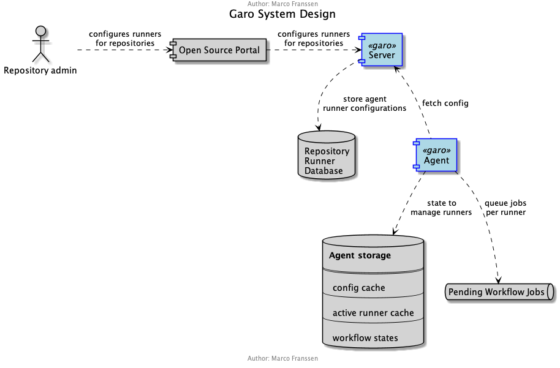

# Garo Architecture

This document describes the envisioned architecture of Garo and how it fits in the landscape of our tooling to manage our source code at scale.

## Overall Github at scale Architecture

In the overall landscape there will be a portal with self-service capabilities. One of these capabilities is to manage your self-hosted runners for your set of repositories. Enabling an end user to manage the amount of runners and their policies.

[][ComponentsOverviewSVG]

## Garo components and dependencies

In the overall landscape Garo is responsible to keep track on the Github selfhosted Actions Runners and orchestrate them in a cost effective manner. It also exposes self-service capabilities to manage the Github selfhosted Actions Runners.

**Garo Server** side manages Northbound APIs to integrate with the **Open Source Portal**, providing self-service capabilities. Southbound **Garo Server** exposes APIs for **Garo Agents** to fetch latest configurations.

[][GaroArchitectureSVG]

### Server

**Garo Server** can be deployed close to the **Open Source Portal** which should result in low response times to this static web page. Depending of the scale multiple intances could be deployed to distribute the load.

Features:

- configure runners per repository
- provide a list of available garo agents
- provide configuration per agent

### Agent

**Garo Agent** can be deployed in an isolated network close to the runners. This allows for a closed environment without outside-in connections. Furthermore each agent will be responsible for a given set of repositories. This allows for effective cost management and insights.

To limit the risks on a project/deparment base many instances of agents can be deployed in isolated environments.

This is a security design decision which limits the compromise of our CI/CD infrastructure as well a scalability design decision which allows workflow runner orchestration at big scale.

Features:

- register with the upstream server
- unregister from the upstream server
- fetch configuration from server
- provision an self-hosted runner instance
- shutdown self-hosted runners (after grace period)
- queue workflow jobs for which no runner is available

[ComponentsOverviewSVG]: diagrams/components-overview.svg "Open Components Overview as SVG"
[GaroArchitectureSVG]: diagrams/garo-architecture.svg "Open Garo Architecture as SVG"
